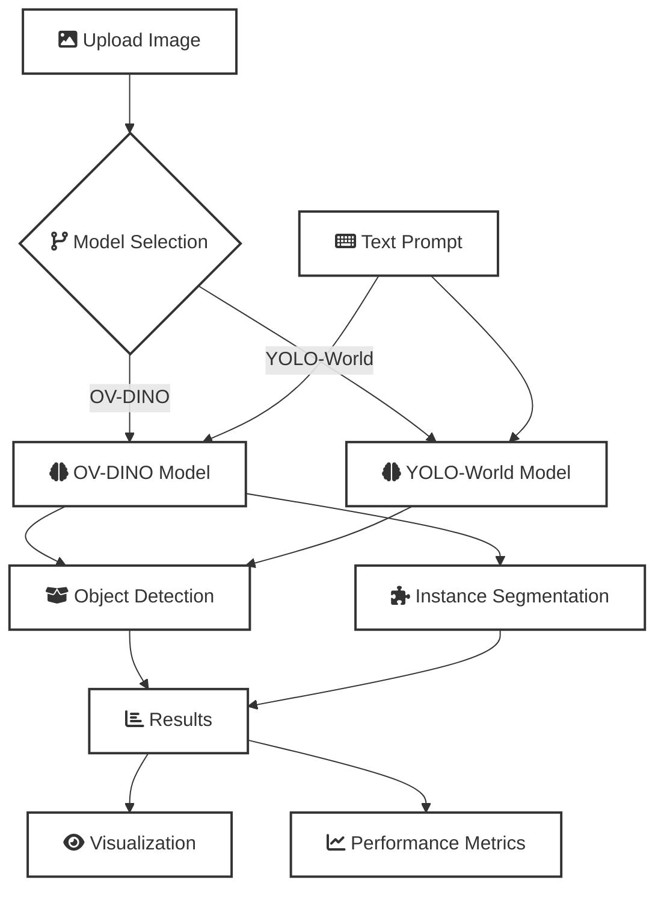

# 🖼️ InstaDetect

Multi-Model Object Detection and Segmentation using OV-DINO & YOLO-World

## 🎯 Overview

InstaDetect is a powerful visual intelligence system that performs open-vocabulary object detection and instance segmentation using state-of-the-art models: OV-DINO and YOLO-World.

## 🔄 Workflow



## ✨ Features

- 🔄 Switch between OV-DINO and YOLO-World models
- 📤 Upload images for analysis
- 🎯 Custom text prompt-based detection
- 📦 Bounding box visualization
- 🧩 Instance segmentation
- 📊 Performance metrics display

## 🚀 Getting Started

### Prerequisites

- Python 3.8+
- pip

### Installation

1. Clone the repository:
```bash
git clone https://github.com/chuck-ankit/instadetect
cd instadetect
```

2. Install dependencies:
```bash
pip install -r requirements.txt
```

3. Run the application:

Frontend:
```bash
cd app
streamlit run main.py
```

Backend:
```bash
cd backend
uvicorn main:app --reload
```

Note: Run both frontend and backend in separate terminal windows.

## 🏗️ Project Structure

```
instadetect/
├── app/                  # Frontend (Streamlit)
├── backend/             # API backend (FastAPI)
│   ├── routes/
│   ├── ov_dino_engine.py
│   └── yolo_world_engine.py
├── models/              # Model weights and configs
├── utils/              # Helper functions
├── static/             # Image storage
├── requirements.txt
└── README.md
```

## 📝 License

This project is licensed under the MIT License - see the LICENSE file for details.

## 🤝 Contributing

Contributions are welcome! Please feel free to submit a Pull Request.
